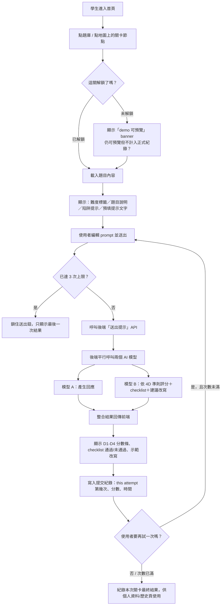
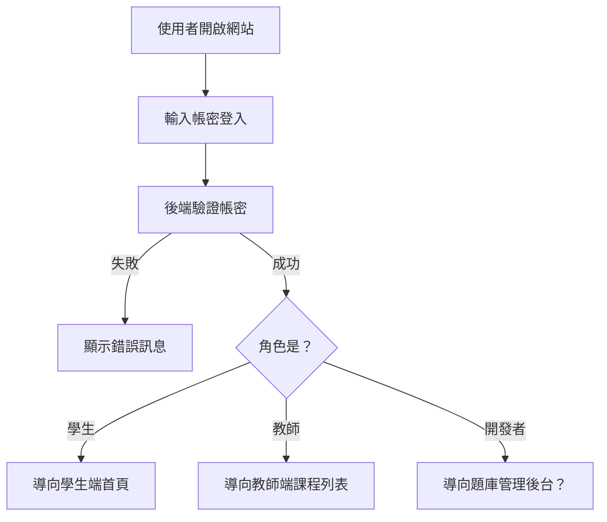
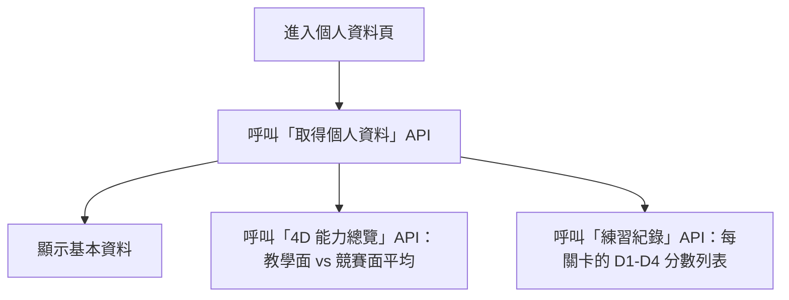
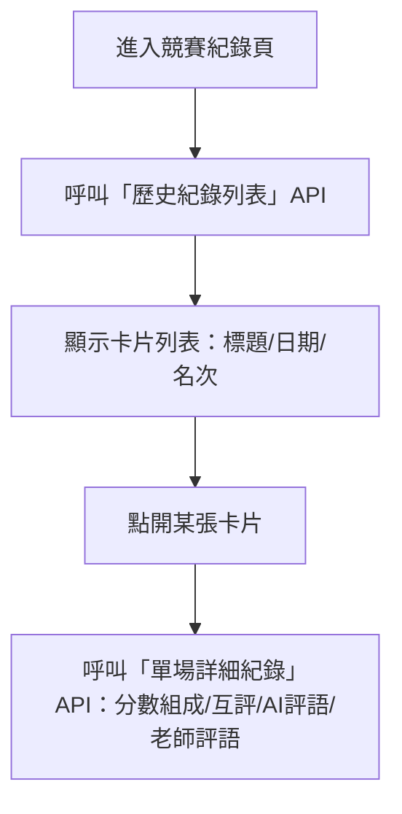
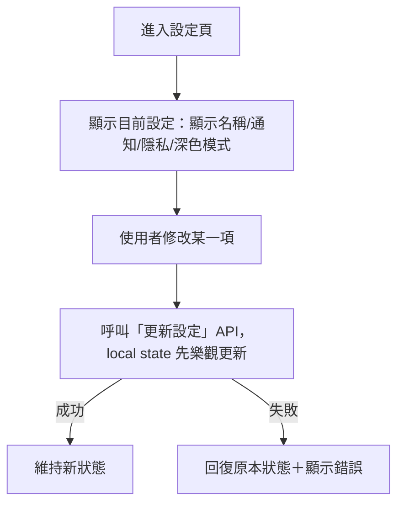
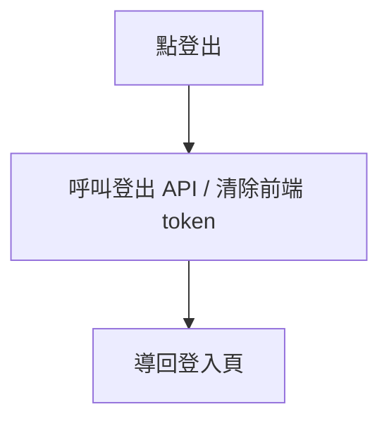

# 練習題 + 系統功能：流程討論

跟 [plan-practice-module.md](plan-practice-module.md)（討論大綱＋to-do list）搭配使用：
這份專門畫「使用者實際走過的流程」，方便討論每一步要呼叫哪個 API、卡在哪裡、
資料要存什麼。一樣只放在 `discuss/*` branch，不進 `main`；流程一旦定案，
對應的 API 規格搬進正式文件（例如之後的 `docs/api-spec.md`）。

---

## 一、題目（練習題）流程

### 1-1 整體流程圖

### 1-2 逐步拆解（討論用，每步標注「現況（原型假資料）」vs「需要後端做的事」）

| 步驟 | 現況（前端原型的假資料/假邏輯） | 需要後端做的事 |
|---|---|---|
| 進入題庫 | `BANK_LIST` 寫死在 JS 裡 | 題庫列表 API（含難度篩選），資料從資料庫來 |
| 選題載入 | `TASKS[id]` 直接查物件 | 依 id 查單一題目 API，回傳 tag/title/brief/trap/prefill/checklist 等欄位 |
| 判斷解鎖 | `preview:true/false` 寫死 | 依使用者的關卡進度判斷是否解鎖（需要「使用者關卡進度」資料表） |
| 送出提示 | `setTimeout` 假動畫 + 寫死的 `scores`/`checklist`/`rewrite` | **核心 API**：接收 prompt → 平行呼叫模型 A（生成回應）+ 模型 B（4D 評分）→ 整合回傳 |
| 次數限制 | 前端變數 `attempt`，重新整理就重置 | 次數要存在後端（依使用者+題目），避免重新整理繞過限制 |
| 紀錄結果 | 完全沒存，重新整理就消失 | 提交紀錄表：使用者、題目、第幾次嘗試、四維分數、時間戳記 |

### 1-3 需要團隊先決定的問題（呼應 plan-practice-module.md 1-1 / 1-2 / 1-3）

- [ ] 「解鎖」邏輯怎麼定義？照順序解鎖，還是全部開放讓學生自由選？
- [ ] 3 次上限是全域固定，還是題目難度不同上限也不同？
- [ ] 模型 A（生成回應）跟模型 B（4D 評分）失敗時（API 逾時/出錯）前端要怎麼呈現？要不要重試？
- [ ] checklist 的「通過/未通過」是模型 B 直接給結構化結果，還是後端再用規則二次判斷？

---

## 二、其他系統功能流程

### 2-1 登入 / 角色判斷

- [ ] 「開發者」是不是一個獨立角色、有沒有自己的畫面？還是開發者其實就是工程團隊自己用資料庫工具寫入，不需要專屬 UI？（呼應 plan-practice-module.md 1-2）
- [ ] 登入方式：帳密、還是學校 SSO／Google 登入？

### 2-2 個人資料／能力總覽

- 對應原型 [PROFILE 畫面](../frontend/src/prototypes/學生端_最初版.html)。
- [ ] 「教學面平均」「競賽面平均」怎麼算？用最近 N 次、還是全部歷史平均？

### 2-3 練習紀錄／歷史查詢

- 這裡原型顯示的是「競賽」歷史，練習題本身要不要也有類似的「練習歷史」列表？
      （目前只在個人資料頁看得到練習紀錄表格，沒有像競賽一樣可以點開的詳細卡片）

### 2-4 設定變更

- [ ] 深色模式要不要存後端？（純前端 localStorage 記憶也可以，不一定要進資料庫）
- [ ] 密碼修改流程：原型只有一個按鈕沒有實際表單，要設計成 modal 還是獨立頁面？

### 2-5 登出

- 原型目前按鈕完全沒接（見 CHANGELOG.md 2026-09-22 那則紀錄），屬於這塊要補的功能。

---

## 待確認事項彙總（討論會議時逐條過）

- [ ] 關卡解鎖規則
- [ ] 提交次數限制的邏輯與儲存方式
- [ ] AI 模型呼叫失敗的前端呈現與重試機制
- [ ] checklist 通過/未通過的判定由誰做（模型 B 直接給 vs 後端二次判斷）
- [ ] 開發者角色是否需要獨立登入與 UI
- [ ] 登入方式（帳密 / SSO / OAuth）
- [ ] 4D 能力總覽的計算範圍（最近 N 次 vs 全部歷史）
- [ ] 練習題要不要也有像競賽一樣「可點開的詳細歷史卡片」
- [ ] 深色模式等純前端偏好要不要存後端
- [ ] 密碼修改的 UI 形式
