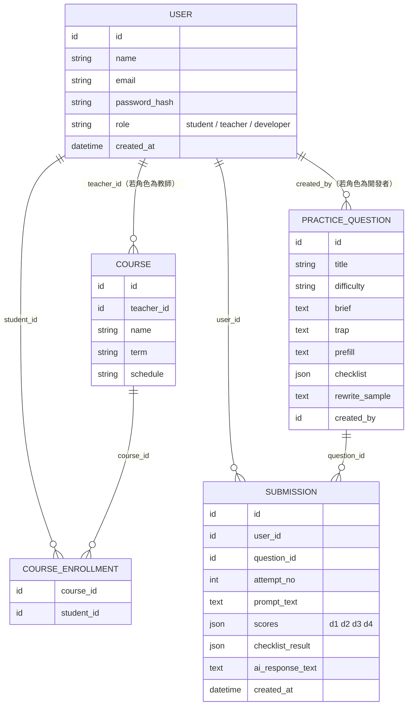

# 系統功能初步規劃書（草案 v0.1）

**性質**：這是「練習題＋系統功能」這塊的初步功能規劃，範圍比 [plan-practice-module.md](plan-practice-module.md)
更廣一點——把登入帳號、課程管理也一併納入盤點，因為這幾塊雖然不是「練習題」本身，
但都是使用者實際會碰到、而且目前沒人明確認領的系統功能。**還是草案**，需要拿去跟
另一位後端（競賽）、管理者對過範圍界線後才算定案。跟其他文件的關係：

- [plan-practice-module.md](plan-practice-module.md)：練習題本身的討論大綱＋to-do list（更細）
- [flow-practice-module.md](flow-practice-module.md)：使用者流程圖
- 這份文件：**五大功能模組的整體盤點**，給團隊會議時對範圍、對優先順序用

只放在 `discuss/practice-module` branch，不進 `main`；定案的部分會分別搬進
`docs/architecture.md`（結構）、`CLAUDE.md`（規則）、或未來的 `docs/api-spec.md`（API）。

---

## 五大功能模組總覽

大方向依使用者提出的五塊來拆：題庫管理、題目練習、登入與帳號管理、個人能力分析、課程管理。

### 1. 登入與帳號管理

| 項目 | 內容 |
|---|---|
| 功能項目 | 註冊／登入、角色判斷（學生／教師／開發者）、登出、修改個人基本資料、修改密碼 |
| 對應原型 | 學生端／教師端 SETTINGS 畫面的「帳號設定」區塊（登出、修改密碼按鈕目前都沒接） |
| 資料表雛形 | `User(id, name, email, password_hash, role, created_at)` |
| 待討論 | 登入方式（帳密／學校 SSO／Google 登入）；「開發者」是不是獨立角色、要不要專屬 UI；密碼修改要做成 modal 還是獨立頁面 |
| 優先度 | **最高**——團隊已定調這個要最先完成，因為課程、競賽、練習紀錄全部都要綁使用者身份 |

### 2. 課程管理

**2026-09-23 補充**：這塊要分「教師端」跟「學生端」兩套頁面——教師端原型已經有
（課程列表、課程詳情），但**學生端原型目前完全沒有「我的課程」頁面**，屬於原型沒
設計到、邏輯上該補的部分。

| 項目 | 內容 |
|---|---|
| 功能項目 | **教師端**：建立／編輯課程、管理學生名單、查看課程底下過往競賽紀錄。**學生端（新增）**：查看自己選修的課程列表、（可能）課程詳情頁顯示該課程曾發起的競賽 |
| 對應原型 | 教師端「課程列表」「課程詳情」畫面（學生名單 accordion、過往競賽紀錄 accordion）；學生端目前無對應畫面，需要新設計 |
| 資料表雛形 | `Course(id, teacher_id, name, term, schedule)`、`CourseEnrollment(course_id, student_id)` |
| 待討論 | ⚠️ **這塊算誰的範圍需要特別確認**——課程本身的 CRUD 偏「系統管理」性質，但「課程底下發起競賽」是競賽那塊的事。建議跟另一位後端一起開會，明確畫出「課程管理」跟「競賽」的界線在哪一支 API／哪一張表；學生端「我的課程」頁面要不要現在就設計，還是先用最簡單的清單頂著 |
| 優先度 | 高——僅次於登入權限，因為競賽依賴「課程」才能限制「只有選課學生能進入」 |

### 3. 題庫管理

| 項目 | 內容 |
|---|---|
| 功能項目 | 開發者新增／查詢／（視討論）編輯練習題目，含難度分類 |
| 對應原型 | 學生端原型裡的 `BANK_LIST`／`TASKS` 資料結構；教師端「新增題庫」UI 可參考格式，但那個是給教師建競賽案例用的，不同資料形狀（見 [plan-practice-module.md 1-1](plan-practice-module.md)） |
| 資料表雛形 | `PracticeQuestion(id, title, difficulty, brief, trap, prefill, checklist[], rewrite_sample)` |
| 待討論 | 題庫用種子資料寫死還是要後台介面；是否跟競賽共用（結論傾向不共用，見 1-1 討論） |
| 優先度 | 中——阻塞「題目練習」功能，但可以先用種子資料頂著，讓「題目練習」的其他部分（送出流程、評分串接）先開發 |

### 4. 題目練習

| 項目 | 內容 |
|---|---|
| 功能項目 | 瀏覽題庫、選題進入練習、送出 prompt、平行呼叫雙 AI 模型（生成回應＋4D 評分＋checklist＋示範改寫）、次數限制（原型是 3 次）、紀錄提交結果 |
| 對應原型 | 學生端「TASK PLAYER（dojo）」畫面 |
| 資料表雛形 | `Submission(id, user_id, question_id, attempt_no, prompt_text, scores_json, checklist_result, created_at)` |
| 待討論 | 雙模型怎麼接、評分 rubric 設計、次數限制與濫用防範（見 [plan-practice-module.md 1-3](plan-practice-module.md)、[flow-practice-module.md 一、題目流程](flow-practice-module.md)） |
| 優先度 | **高**——這是整個平台的核心賣點與機制，建議題庫、登入完成後優先做這塊 |

### 5. 個人能力分析

| 項目 | 內容 |
|---|---|
| 功能項目 | 個人基本資料、4D 能力總覽（教學面 vs 競賽面平均）、練習紀錄列表 |
| 對應原型 | 學生端 PROFILE／HISTORY 畫面 |
| 資料表雛形 | 不一定需要獨立表，可能是從 `Submission`（＋競賽那邊的紀錄）聚合計算的查詢 API |
| 待討論 | 平均值計算範圍（最近 N 次 vs 全部歷史，見 [flow-practice-module.md 2-2](flow-practice-module.md)）；要不要跟競賽那邊的分數表打通做「綜合」報表 |
| 優先度 | 低——依賴前面幾塊先有資料才能分析，可以放最後 |

---

## 設計流程建議：功能設計跟資料庫設計要一起做，不要切成兩階段

2026-09-23 討論：不建議「先把所有畫面/流程設計完，才開始設計資料庫」，也不建議
反過來「資料庫先 100% 設計完才做功能設計」。理由：

- 兩份 HTML 原型 + [flow-practice-module.md](flow-practice-module.md) 其實已經藏著資料表該長怎樣的線索
  （例如原型的 `TASKS` 物件，直接告訴你「練習題」這個實體大概需要哪些欄位）。
- 等全部功能設計都定案才畫資料庫，容易畫出「畫面順但資料庫關聯畫不出來」的設計，
  回頭要改設計反而更費工。
- 但資料庫也不能整套先做完，因為很多欄位（例如個人能力分析要不要跨競賽/練習算平均）
  要等流程細節定案才知道怎麼設計。

**建議做法**：先畫一版「粗略的」ER 圖抓大方向（見下方草稿），之後每次某個模組的
流程細節定案，就回來補這張圖的細節，反覆迭代，而不是切成「設計期」「資料庫期」兩個
不重疊的階段。

**登入／User 模型是例外，要現在就先定案**（不只是「優先做」，是「現在就要決定長什麼樣」）：
因為 `Course`、`PracticeQuestion`、`Submission` 幾乎每張表都會參照 User，如果 User 的角色
設計（單一 role 欄位 vs 多張角色表）還沒定，後面的表會全部卡住重改。

### ER 圖草稿（v0.1，粗略版，僅供討論）



**這版草稿刻意先不畫的部分**（留給後面迭代，或跟競賽那邊討論後再補）：
- 競賽相關的表（Team、Case、CompetitionResult 等）——那是另一位後端的範圍，但 `USER`
  跟（可能）`COURSE` 會被兩邊共用，之後要跟他對一下欄位會不會衝突
- 「個人能力分析」沒有獨立的表，先假設是從 `SUBMISSION` 聚合算出來的查詢，如果之後
  發現算起來太慢，可能要加一張快取用的彙總表
- `USER.role` 先假設是單一欄位（一個帳號只有一種角色），如果之後發現「一個人可能
  同時是某堂課的學生、又是題庫開發者」，這裡要改成多對多的角色表

---

## 建議開發順序

```
1. 登入與帳號管理（最優先，阻塞一切）
2. 課程管理（僅次於登入，因為競賽依賴課程；範圍需先跟競賽後端對過）
   └─ 可與「題庫管理」平行開發，兩者互不依賴
3. 題庫管理（可用種子資料先頂著，不一定要等後台介面做完）
4. 題目練習（核心機制，題庫＋登入完成後即可開始，是重點）
5. 個人能力分析（放最後，需要前面累積資料才有意義）
```

---

## 待跟團隊確認的事項彙總

- [ ] 課程管理的範圍界線——哪些 API／功能算「系統功能」、哪些算「競賽」的一部分
- [ ] 登入方式（帳密／SSO）
- [ ] 開發者角色要不要獨立 UI
- [ ] 題庫共用 vs 分開（傾向分開，見 1-1）
- [ ] 雙 AI 模型怎麼接（見 1-3）
- [ ] 4D 能力分析的計算範圍

（以上細節分別在 [plan-practice-module.md](plan-practice-module.md) 跟 [flow-practice-module.md](flow-practice-module.md) 裡有更詳細的討論，這份文件是給團隊會議時看整體範圍用的摘要版。）
